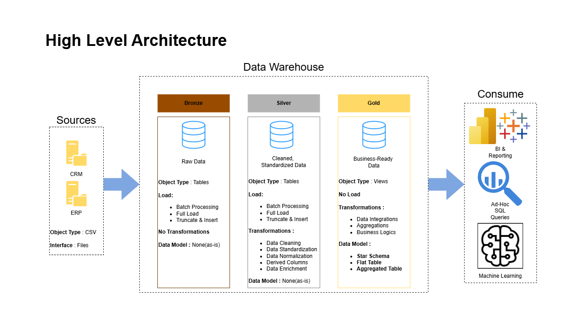
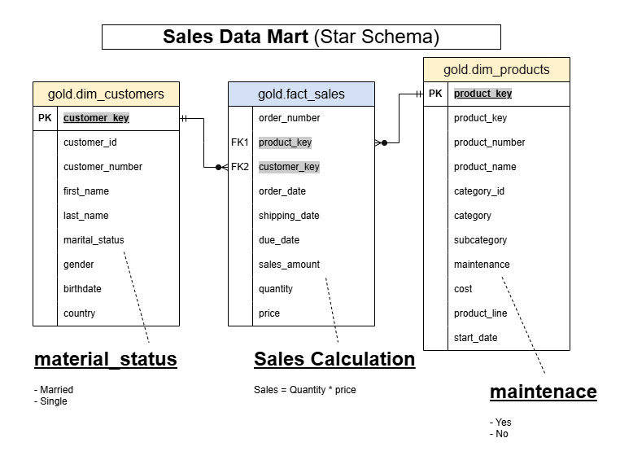

# SQL Data Warehouse Project

An end-to-end data warehouse portfolio project built with SQL Server and T-SQL. This repository takes raw CRM and ERP CSV exports, loads them into a Medallion-style warehouse, and transforms them into an analytics-ready star schema for reporting and downstream BI.

`SQL Server` `T-SQL` `ETL` `Data Warehousing` `Medallion Architecture` `Star Schema`

## Overview

- Designed a modern data warehouse using Bronze, Silver, and Gold layers.
- Loaded raw CSV files from multiple source systems into SQL Server with `BULK INSERT`.
- Cleaned, standardized, and integrated source data through T-SQL stored procedures.
- Modeled business-ready dimensions and facts for customer, product, and sales analysis.
- Added SQL-based quality checks and supporting documentation for maintainability.



## Business Goal

Operational sales data often lives in separate systems and inconsistent file extracts, which makes reliable reporting difficult. The goal of this project is to centralize CRM and ERP data into a single warehouse and create a trustworthy analytical model for:

- Customer behavior analysis
- Product performance tracking
- Sales trend reporting
- BI and dashboard consumption

## Architecture

This project follows the Medallion Architecture pattern:

| Layer | Purpose | Key Assets |
|---|---|---|
| `bronze` | Raw ingestion of source data with minimal transformation | Source-aligned tables, `bronze.load_bronze` |
| `silver` | Data cleansing, standardization, deduplication, and enrichment | Cleaned tables, `silver.load_silver` |
| `gold` | Business-ready analytical model for reporting | `gold.dim_customers`, `gold.dim_products`, `gold.fact_sales` |

## Data Pipeline

### Bronze Layer

The Bronze layer stores raw CRM and ERP extracts exactly as landed from CSV files. This layer is used as the ingestion point for:

- CRM customer, product, and sales data
- ERP customer, location, and product category data

### Silver Layer

The Silver layer applies business and data quality rules, including:

- Deduplicating customer records using the latest available record
- Trimming and standardizing text values
- Normalizing gender, marital status, product line, and country values
- Converting integer-based source dates into SQL `DATE`
- Fixing invalid sales and price values
- Removing future birthdates
- Preparing product history using start and end dates

### Gold Layer

The Gold layer exposes a star schema designed for analytics:

- `gold.dim_customers`: customer dimension enriched from CRM and ERP
- `gold.dim_products`: current product dimension with category and maintenance attributes
- `gold.fact_sales`: sales fact linked to customer and product dimensions



## Data Model

The final analytical model is intentionally simple and reporting-friendly:

- `dim_customers` contains customer profile, geography, and demographic attributes
- `dim_products` contains product, category, subcategory, cost, and product line details
- `fact_sales` stores order-level sales measures such as quantity, price, and sales amount

Additional metadata for the Gold layer is documented in [docs/data_catalog.md](docs/data_catalog.md).

## Repository Structure

```text
sql-data-warehouse-project/
├── datasets/                          
|   ├── source_crm/
|   ├── source_erp/
├── docs/                              
|   ├── data-flow.png                    
|   ├── data-model.png                    
|   ├── data_integration.png             
|   ├── high-level-architecture.png
|   ├── data_catalog.md
|   ├── naming_conventions.md
├── scripts/
|   ├── init_database.sql
|   ├── bronze/
|   |   ├── ddl_bronze.sql
|   |   ├── proc_load_bronze.sql
|   ├── silver/
|   |   ├── ddl_silver.sql
|   |   ├── proc_load_silver.sql
|   ├── gold/
|       ├── ddl_gold.sql
├── tests/
|   ├── quality_checks_silver.sql
|   ├── quality_checks_gold.sql
├── README.md
```

## Tech Stack

- SQL Server
- T-SQL
- CSV source files
- Stored procedures
- Views for dimensional modeling
- SQL-based data quality validation

## How to Run

1. Run [scripts/init_database.sql](scripts/init_database.sql) to create the `DataWarehouse` database and the `bronze`, `silver`, and `gold` schemas.
2. Run the DDL scripts to create the Bronze and Silver tables:
   - [scripts/bronze/ddl_bronze.sql](scripts/bronze/ddl_bronze.sql)
   - [scripts/silver/ddl_silver.sql](scripts/silver/ddl_silver.sql)
3. Run [scripts/gold/ddl_gold.sql](scripts/gold/ddl_gold.sql) to create the Gold views.
4. Review [scripts/bronze/proc_load_bronze.sql](scripts/bronze/proc_load_bronze.sql) and update the hardcoded CSV file paths so they match your local machine.
5. Create the ETL procedures:
   - [scripts/bronze/proc_load_bronze.sql](scripts/bronze/proc_load_bronze.sql)
   - [scripts/silver/proc_load_silver.sql](scripts/silver/proc_load_silver.sql)
6. Execute the load procedures:

```sql
EXEC bronze.load_bronze;
EXEC silver.load_silver;
```

7. Run the validation scripts:
   - [tests/quality_checks_silver.sql](tests/quality_checks_silver.sql)
   - [tests/quality_checks_gold.sql](tests/quality_checks_gold.sql)

## Data Quality Checks

The project includes SQL test scripts to validate:

- Null or duplicate business keys
- Unexpected whitespace in critical fields
- Standardized categorical values
- Invalid or out-of-order dates
- Sales amount consistency with quantity and price
- Surrogate key uniqueness in dimensions
- Fact-to-dimension relationship integrity

## Documentation

- [Data Catalog](docs/data_catalog.md)
- [Naming Conventions](docs/naming_conventions.md)

  ## Credits

This project was built following a tutorial by **[Data with Baraa](https://www.youtube.com/@DataWithBaraa)**. 

- **Tutorial Link**: [SQL Data Warehouse from Scratch | Full Hands-On Data Engineering Project](https://www.youtube.com/watch?v=9GVqKuTVANE)
- **Author**: [Data with Baraa](https://www.youtube.com/@DataWithBaraa)


## License

This project is licensed under the [MIT License](LICENSE).
